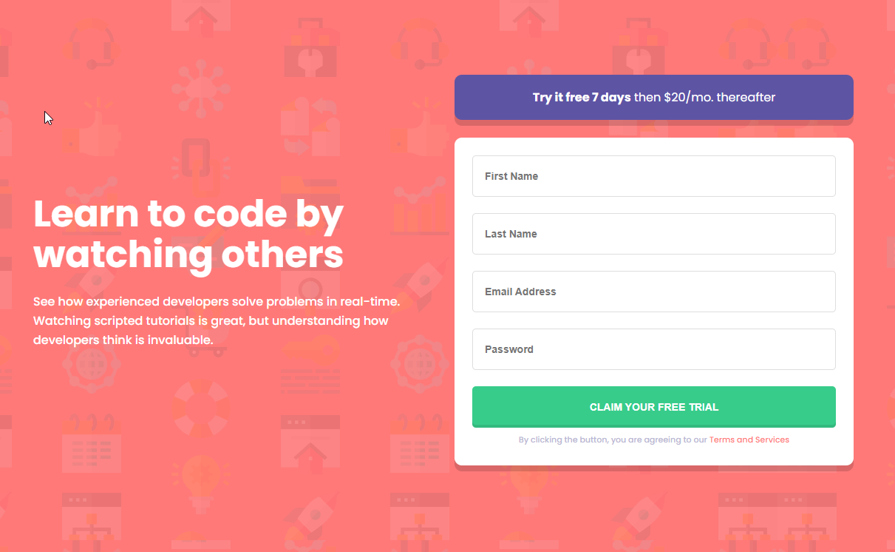

# Frontend Mentor - Intro component with sign up form solution

This is a solution to the [Intro component with sign up form challenge on Frontend Mentor](https://www.frontendmentor.io/challenges/intro-component-with-signup-form-5cf91bd49edda32581d28fd1)

# you can view the live site [here.](https://kieran-gill-e-learning-landing-page.vercel.app/)

## Table of contents

- [Overview](#overview)
  - [The challenge](#the-challenge)
  - [Screenshot](#screenshot)
  - [Links](#links)
- [My process](#my-process)
  - [Built with](#built-with)
  - [What I learned](#what-i-learned)
  - [Continued development](#continued-development)
  - [Useful resources](#useful-resources)
- [Author](#author)
- [Acknowledgments](#acknowledgments)

**Note: Delete this note and update the table of contents based on what sections you keep.**

## Overview

### The challenge

Users should be able to:

- View the optimal layout for the site depending on their device's screen size
- See hover states for all interactive elements on the page
- Receive an error message when the `form` is submitted if:
  - Any `input` field is empty. The message for this error should say _"[Field Name] cannot be empty"_
  - The email address is not formatted correctly (i.e. a correct email address should have this structure: `name@host.tld`). The message for this error should say _"Looks like this is not an email"_

### Screenshot

### Links

- [Live Site](https://kieran-gill-intro-component-sign-up.vercel.app/)

## My process

### Built with

- JavaScript
- Semantic HTML5 markup
- CSS custom properties
- Flexbox
- Mobile first workflow

### What I learned

### What I learned

- I used vanilla JS for this challenge. I enjoyed mixing a codewars style challenge with CSS and HTML. Using the three at random to achieve the desired effects felt like a dance and was very fun. It was a very rewarding challenge as I feel it helped me to cement some more of the JS fundamentals

- I expanded on the design brief a bit by adding js to let the user know if their input was accepted as well as rejected. I added a green border box and message to display this as well as the red error messages assigned in the brief.

- I also added a ‘success’ message/popup that displayed once the user had inputted the form correctly. the message tells the users that they can begin their free trial and invites them to open a link to explore the content (The link just takes the user to come cute dog pictures.)

- I’m still learning JS and this is my first time using vanilla JS to validate a form. I have used form libraries like Formik in the past. I’m not sure if my solution is the most efficient or best practice. I look forward to seeing how others in the FEM community solved it.

- I wasn't sure what to do with the values submitted to the form, the brief did not state this either. I assigned the values to and object and printed it to the console.

- I was battling this error for a while ,‘**Uncaught TypeError: Cannot set property ‘textContent’ of undefined’ , before I realised that** I was looping through the inputs but I hadn't counted the submit button as an input in my planning. Stack Overflow saved the day as usual.

### Continued development

As I continue along the path and learn more about Javascript I intend to revisit this challenge and see if I can refactor it to make it tighter and more efficient.

### Useful resources

Stack Overflowww!

## Author

- [Kieran Gill - Portfolio ](https://kieran-gill-portfolio.netlify.app/)
- [Frontend Mentor profile](hhttps://www.frontendmentor.io/profile/KieranWebDev)
- [LinkedIn](www.linkedin.com/in/kieran-gill)
